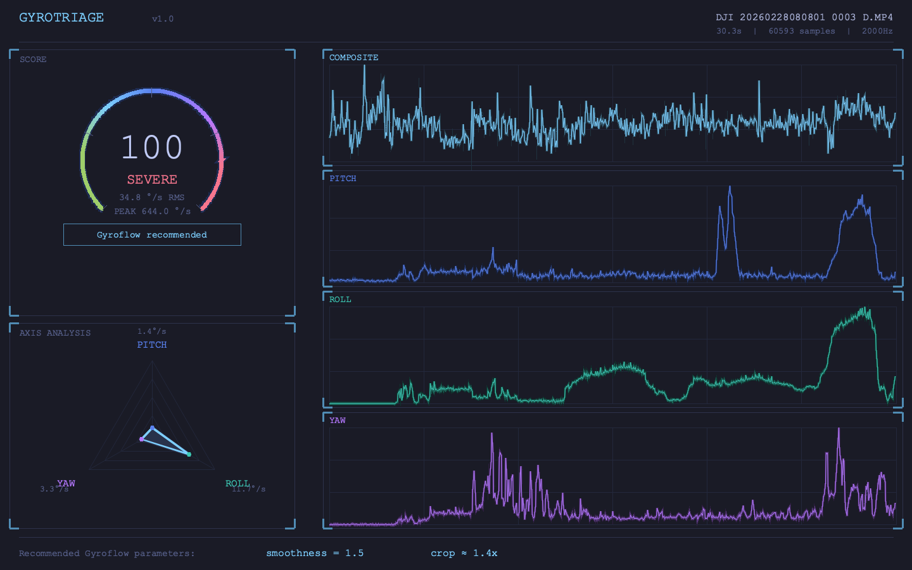

# gyrotriage

A Rust CLI tool that extracts motion data (quaternions) from DJI FPV drone MP4 files (Avata/Neo series), scores shake severity, and recommends Gyroflow stabilization parameters.

Renders futuristic HUD-style graphics directly in your terminal.



## Features

- Extracts quaternion attitude data from MP4 (via telemetry-parser)
- RMS angular velocity based shake score (0–100) with 4-level grading (STABLE/MILD/MODERATE/SEVERE)
- **FFT/PSD-based Gyroflow parameter recommendation** — estimates 5 stabilization parameters from frequency analysis of angular velocity data:
  - Smoothness (%)
  - Max smoothness (s)
  - Max smoothness at high velocity (s)
  - Zoom limit (%)
  - Zooming speed (s)
- HUD-style graphical output (score gauge, radar chart, 4-axis line graphs)
- Sixel / iTerm2 protocol terminal inline image display
- ANSI sparkline lightweight visualization

## Installation

```bash
cargo install --path .
```

Or via Homebrew (macOS):

```bash
brew install gyrotriage
```

## Usage

```bash
# Basic text output
gyrotriage clip.MP4

# HUD graphic display in terminal
gyrotriage clip.MP4 --visual

# Export as PNG image file
gyrotriage clip.MP4 --output-image shake.png

# Both
gyrotriage clip.MP4 --visual --output-image shake.png

# Text output with ANSI sparklines
gyrotriage clip.MP4 --sparkline
```

### Options

| Option | Description |
|---|---|
| `--visual` | Display HUD graph in terminal via Sixel/iTerm2 |
| `--output-image <PATH>` | Export as PNG image file |
| `--sparkline` | Append ANSI sparklines to text output |
| `--sixel` | Force Sixel protocol (use with `--visual`) |
| `--iterm2` | Force iTerm2 protocol (use with `--visual`) |

### Output example

```
File:        DJI_20260228080801_0003_D.MP4
Duration:    30.3s (60593 samples @ 2000Hz)
Score:       100 / 100
Level:       SEVERE
RMS:         34.8 °/s
Peak:        644.0 °/s
Pitch:       avg=1.4°/s  std=2.2°/s  max=47.9°/s
Roll:        avg=11.7°/s  std=13.5°/s  max=251.1°/s
Yaw:         avg=3.3°/s  std=4.4°/s  max=89.0°/s
---
Gyroflow:    smoothness=21%  max=0.300s  max@hv=0.030s
             zoom_limit=118%  zooming_speed=2.6s
```

## Supported Devices

| Device | Requirements |
|---|---|
| DJI Avata / Avata 2 | EIS (Rocksteady) OFF, FOV Wide |
| DJI Neo / Neo2 | Aspect ratio 4:3 (EIS is automatically off) |

Motion data is not recorded when shooting in 16:9 (Neo/Neo2) or with EIS enabled (Avata series), making analysis impossible.

## Scoring

| Level | Score | RMS angular velocity | Meaning |
|---|---|---|---|
| STABLE | 0–25 | < 5 deg/s | Almost no shake, no stabilization needed |
| MILD | 26–50 | 5–10 deg/s | Slight shake, stabilization optional |
| MODERATE | 51–75 | 10–15 deg/s | Noticeable shake, Gyroflow recommended |
| SEVERE | 76–100 | > 15 deg/s | Heavy shake, Gyroflow strongly recommended |

## Gyroflow Parameter Recommendation

gyrotriage estimates Gyroflow stabilization parameters using FFT/PSD (Power Spectral Density) analysis of the angular velocity time series. The approach is based on signal processing — no training data or subjective quality assessment is required.

| Parameter | How it's estimated |
|---|---|
| Smoothness (%) | PSD shake power ratio + RMS angular velocity |
| Max smoothness (s) | PSD cutoff frequency → time constant τ = 1/(2πfc) |
| Max smoothness at high velocity (s) | High-velocity cutoff frequency → time constant |
| Zoom limit (%) | Derived from smoothness + RMS angular velocity |
| Zooming speed (s) | Coefficient of variation of rolling RMS angular velocity |

For the full algorithm details, see:
- [docs/recommendation-algorithm.en.md](docs/recommendation-algorithm.en.md) (English)
- [docs/recommendation-algorithm.ja.md](docs/recommendation-algorithm.ja.md) (Japanese)

## Documentation

- [docs/spec.md](docs/spec.md) — Functional specification (Japanese)
- [docs/concept.md](docs/concept.md) — Concept document (Japanese)
- [docs/recommendation-algorithm.en.md](docs/recommendation-algorithm.en.md) — Recommendation algorithm (English)
- [docs/recommendation-algorithm.ja.md](docs/recommendation-algorithm.ja.md) — Recommendation algorithm (Japanese)
- [docs/adr-004-visual-output.md](docs/adr-004-visual-output.md) — Visual output specification (ADR-004)
- [docs/architectural-decision.md](docs/architectural-decision.md) — Rust adoption decision (ADR-001)

## Development

```bash
cargo build          # Build
cargo test           # Tests (79 tests)
cargo clippy         # Lint
cargo run -- <FILE>  # Run
```

## License

TBD
